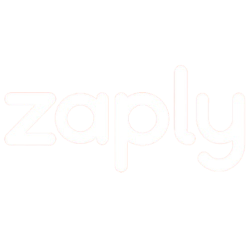

# 🚀 Desafio Frontend Zaply

Bem-vindo ao projeto de desafio frontend! Este projeto foi desenvolvido usando [Next.js](https://nextjs.org) e apresenta um catálogo de produtos com funcionalidades de filtro, pesquisa e visualização detalhada.



## 📋 Sobre o Projeto

Este projeto demonstra uma interface para gerenciamento e visualização de produtos. Para simplificar o desenvolvimento, utilizamos uma abordagem interessante:

- Convertemos dados de produtos originalmente em CSV para formato JSON
- Utilizamos [Mockbin](https://mockbin.io/) para simular uma API, evitando a necessidade de criar um backend
- Os dados são obtidos através da URL: `https://7daf496f49c24182af48ee21542cd665.api.mockbin.io/`

> **Nota sobre imagens:** Em vários produtos, você pode notar que algumas imagens não carregam e retornam um erro 404 com a mensagem "Not Found". Este comportamento é esperado devido à natureza do ambiente de demonstração.

## 🌐 Demo Online

Você pode ver o projeto em funcionamento através do link:
[https://desafio-frontend-zaply.vercel.app/](https://desafio-frontend-zaply.vercel.app/)

## 🚀 Como Iniciar

### Clonando o Repositório

```bash
# Clone este repositório para sua máquina local
git clone https://github.com/SEU-USUARIO/Desafio_Frontend_Zaply.git

# Entre na pasta do projeto
cd Desafio_Frontend_Zaply-main
```

### Instalando Dependências

```bash
# Instale todas as dependências necessárias
npm install
```

### Executando o Projeto

```bash
# Inicie o servidor de desenvolvimento
npm run dev
```

Agora abra [http://localhost:3000](http://localhost:3000) no seu navegador para ver o resultado!

## 🧩 Principais Funcionalidades

- Listagem de produtos com imagens e informações detalhadas
- Filtragem por categorias
- Sistema de busca com debounce
- Interface responsiva e amigável
- Tema claro/escuro

## 🛠️ Tecnologias Utilizadas

- **Next.js** - Framework React
- **TypeScript** - Linguagem
- **Tailwind CSS** - Estilização
- **MockBin** - API simulada

## 📝 Desenvolvimento

Sinta-se à vontade para modificar o projeto! A estrutura de arquivos é organizada da seguinte forma:

- `src/components` - Componentes reutilizáveis
- `src/app` - Páginas e rotas da aplicação
- `src/types` - Definições de tipos TypeScript
- `src/hooks` - Hooks personalizados

## 📬 Feedback

Se você tiver sugestões ou encontrar problemas, por favor abra uma issue ou envie um pull request!
